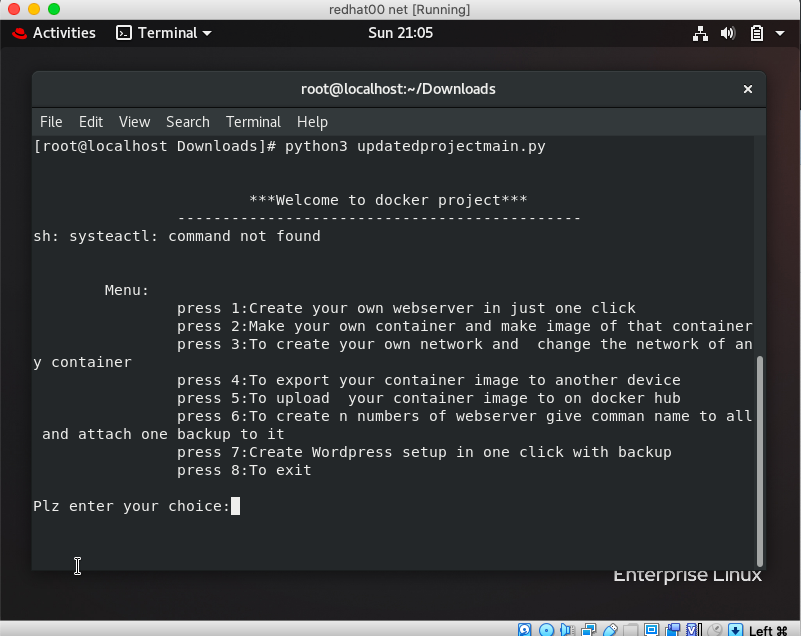
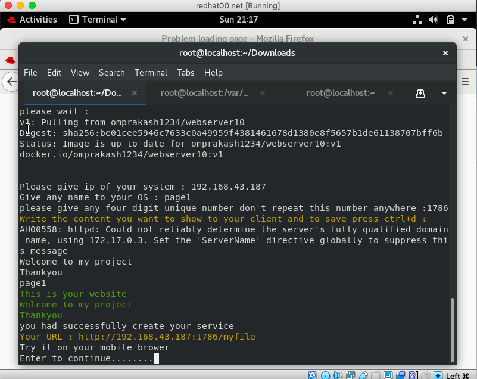
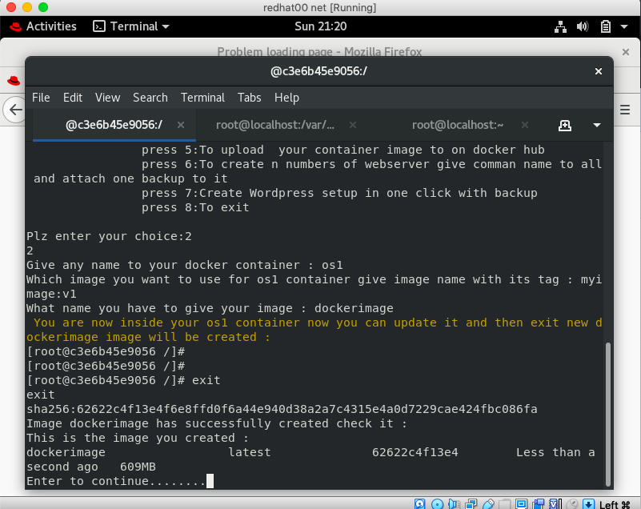
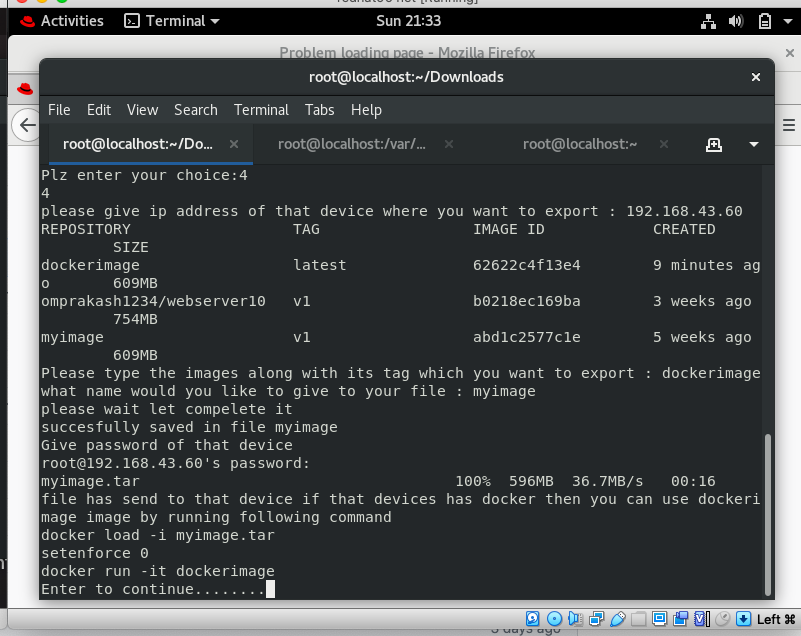
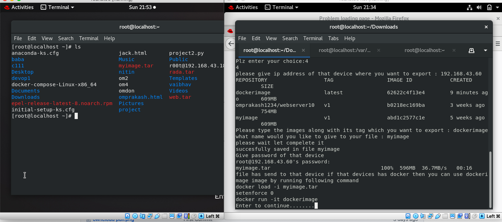
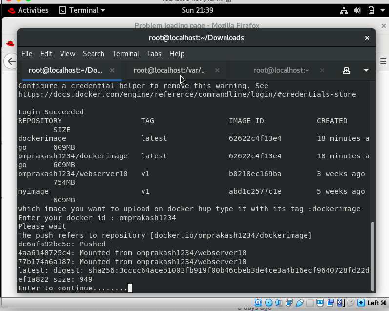
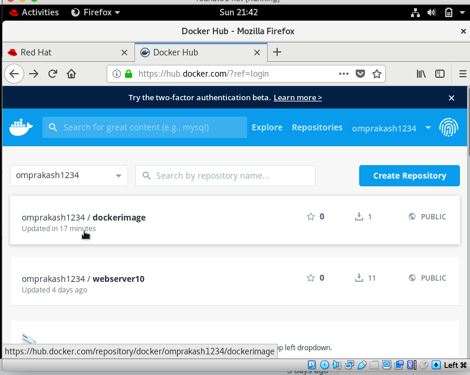
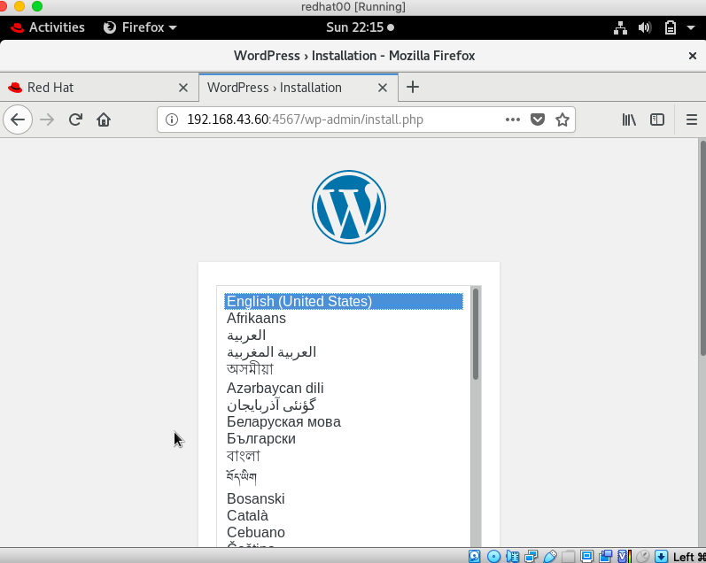

# Docker_Project
This is a Docker project which will do the things faster and easy to user for whose who don't know Docker much .
Only for Redhat8 Linux

## I made this project with the help of IIEC_RISE campaign 

## With this repo you can Automatically :-
   
   1. Create your own webserver in just one click 
   2. Make your own container and make image of that container
   3. To create your own network and  change the network of any container
   4. To export your container image to another device
   5. To upload  your container image to on docker hub
   6. To create n numbers of webserver give comman name to all and attach one backup to it
   7. Create Wordpress setup in one click with backup

## Built with
- Python3.7
- RedHat Linux RHEL8
- Docker
- Mysql
- wordpress

## Requirements/Installation
#### After installation of Redhat Open your root account 
   - Configure the yum 
   - yum install httpd
   - systemctl start httpd 
   - systemctl enable httpd
   - systemctl stop firewalld
   - systemctl disable firewalld
   - setenforce 0
   - Configue the Docker 
   - yum install docker-ce -nobest
   - systemctl start docker
   - systemctl enable docker

**After all this done you have to restart the Redhat**
___
# For Output
```
python3 updatedprojectmain.py
```

## Menu 
  
  
___
## 1. Create your own webserver in just one click 
  
  
  
  After you press enter it will pull one image from docker hub created by me which will help to create
  webserver. 
  you have to give unique port number for your webserver and just write the contain that you want to display.  
  
  
___
## 2. Make your own container and make image of that container
  
    
  
  This will make new image for you.
  You can add many features in your image and can use whenever require. 
___
## 3. To create your own network and  change the network of any container
  
   
  
  Here after pressing 1 just give the name which you want to give to your docker network.
  
    
  
  Here after pressing 2 you will be able to change the network of any container
___  
## 4. To export your container image to another device  
  
  
  
  By this you can export any image to other system provided that both systems are connected to each other 
  Once you export image you have to run this commands(provided by program) to load that image in that system.  
  
  
  
  To check image file is export or not in that system run: `ls` command.
___  
## 5. To upload  your container image to on docker hub
  
  
  First give Username and password to login, then give the image name with its tag which you want to upload.
  It will consume data depend on your image.
  
       
  
  Check on docker hub it is upload or not.
___
##  6. To create n numbers of webserver give comman name to all and attach one backup to it
  
   
  
  All the webserver will have different IPAddress. 
  To ping each other with their name use `curl` command 
  If you create any file in one container it will be created in all the containers because we had attach backup to it. 
___
## 7. Create Wordpress setup in one click with backup
  
  To achieve you have to first install this all: 
    `$ docker pull wordpress:5.1.1-php7.3-apache`
    `$ docker pull mysql:5.7`
    `$ yum install mysql`
                     
  
  
  Give all the required data and it will create wordpress for you.
  You can also check all the information of your wordpress by clicking info.
  In case if wordpress corrupt your data will be safe and to see name of that storage device press info. 
  
  
___  
___

>Thank you  
  
## Author
[**Ompraksh choudhari**](https://github.com/Omprakash50)
   
   [Linkedin](https://www.linkedin.com/in/omprakash-choudhari-252027196)
